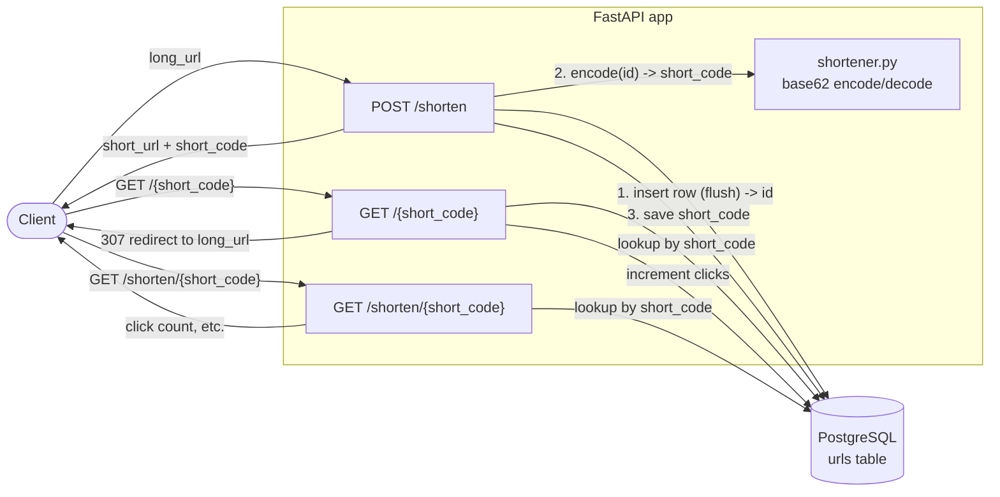

# URL Shortener

A small URL shortener built with FastAPI, SQLAlchemy and Alembic. Short codes are
generated with **base62 encoding of an auto-increment primary key** (`id -> base62`).

## Features

- `POST /shorten` — create a short link from a long URL; returns the full `short_url`
  (`BASE_URL` + `/` + `short_code`). Re-submitting the same long URL returns the
  existing short link (idempotent under normal load; `long_url` has no DB-level unique
  constraint yet, so two concurrent requests for a brand-new URL can still race).
- `GET /{short_code}` — redirect to the original URL (307) and count a click
- `GET /shorten/{short_code}` — fetch info about a short link (click count, etc.)
- Base62 short codes derived from an auto-incrementing integer `id`
- Alembic migrations, Pydantic settings from env, PostgreSQL

## Project layout

```
url_shortener/
├── app/
│   ├── main.py          # FastAPI app + routers
│   ├── config.py        # settings (env: DATABASE_URL, BASE_URL)
│   ├── database.py      # engine / session / Base / get_db
│   ├── models.py        # URL ORM model
│   ├── schemas.py       # Pydantic request/response
│   ├── crud.py          # DB operations
│   ├── shortener.py     # base62 encode/decode
│   └── routers/         # shorten.py, redirect.py
├── alembic/             # migrations
├── tests/               # pytest tests
└── .env.example
```

## Architecture



Short codes are never generated in isolation: the flow always goes
**auto-increment `id` (from PostgreSQL) → `base62 encode` → `short_code`**, which is why
`shortener.py` has no database dependency of its own — it's a pure int-to-string codec
that `crud.create_url` calls once the row's `id` is known.

## Setup

```bash
python -m venv .venv
source .venv/bin/activate
pip install -r requirements.txt
cp .env.example .env
# create the PostgreSQL database (adjust user/host as needed)
createdb url_shortener
createdb url_shortener_test   # used by the test suite
```

## Run

```bash
uvicorn app.main:app --reload
```

Then open http://localhost:8000/docs for the interactive API docs.

Create a short link:

```bash
curl -X POST http://localhost:8000/shorten \
  -H "Content-Type: application/json" \
  -d '{"long_url": "https://example.com/some/long/path"}'
```

## Database / migrations

Schema is managed by Alembic. On startup `Base.metadata.create_all` also runs as a
safety net, but the migrations are the source of truth:

```bash
alembic revision --autogenerate -m "create urls table"
alembic upgrade head
```

## Tests

Tests run against a dedicated `url_shortener_test` PostgreSQL database (configured in
`conftest.py`), so they never touch the development database.

```bash
pytest
```

## Rate limiting & auth

- `POST /shorten` is rate-limited (default `10/minute` per client IP, configurable via
  `RATE_LIMIT`) and rejects `long_url` values longer than `MAX_LONG_URL_LENGTH`
  (default 2048 characters).
- Set `API_KEY` in `.env` to require an `X-API-Key` header on `POST /shorten`. Left
  unset (the default), the endpoint is open — fine for local development, not for a
  public deployment.

## Known limitations / future work

- `long_url` is validated by Pydantic's `HttpUrl`, so only absolute URLs with a
  scheme (e.g. `https://example.com`) are accepted; bare hosts like `example.com`
  are rejected with `422`.
- `GET /{short_code}` and `GET /shorten/{short_code}` are not rate-limited or
  authenticated — only creation is currently protected.
